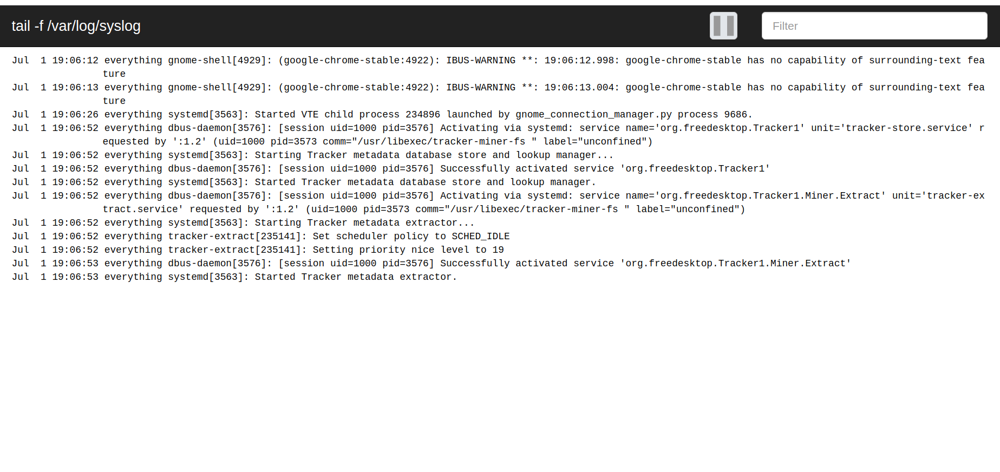

# LogViewer

LogViewer is a Web application for monitoring server logs in real-time in the browser.

##### Screenshot



### Features

1. Highlighting makes the log much more readable.
1. Event filtering by a level, logger, date, thread, etc... Filtering by a custom condition written on JavaScript is available as well.


### Quick start
Download LogViewer from Github releases and unpack it to any folder. Make sure the machine has installed Python3 or later.
```commandline
python3 -m pip install -r requirements.txt
python3 main.py --host 0.0.0.0 --port 8080 --file /var/log/syslog
```
Open http://localhost:8080 then try it

### Configuration

Configuration is located in `config/web.ini`

